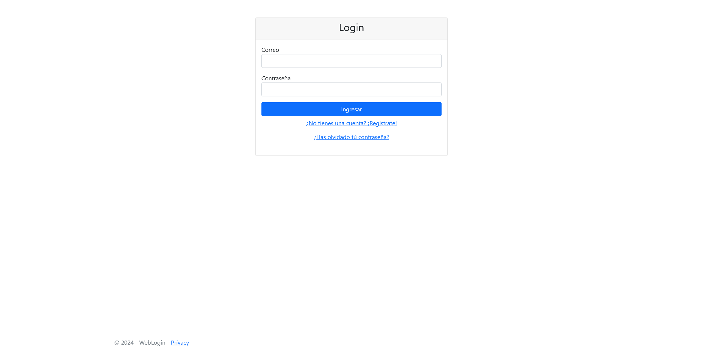
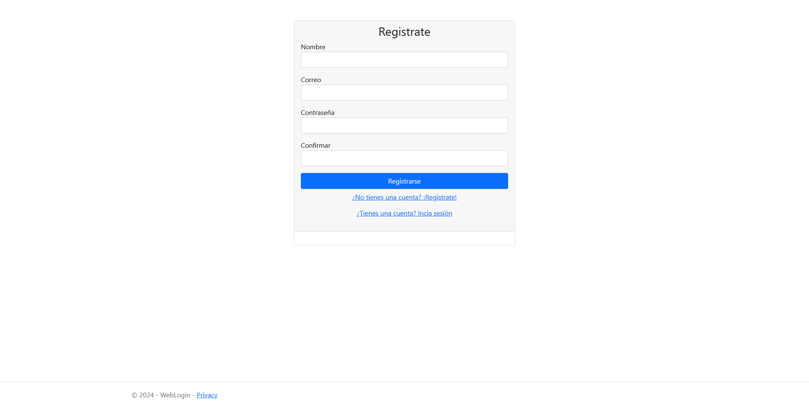
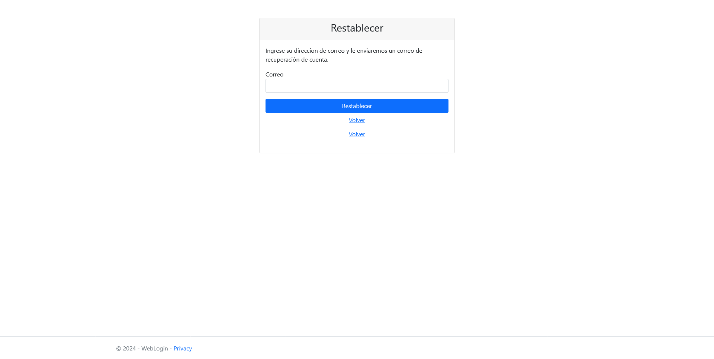
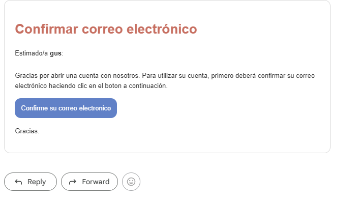

# Proyecto WebLogin

Este es un proyecto ASP.NET Core que implementa un sistema de inicio de sesión y registro con base de datos SQL Server. Incluye funcionalidades de confirmación de cuenta, restablecimiento de contraseña y validación de usuarios.

## Características

- **Inicio de Sesión:**
  Los usuarios pueden iniciar sesión con su correo y contraseña.
  
- **Registro:**
  Los usuarios pueden registrarse con datos como nombre, correo y contraseña.
  
- **Confirmación de Cuenta:**
  Sistema de validación mediante tokens para confirmar el registro.

## Requisitos Previos

1. **Herramientas necesarias:**
   - .NET SDK (versión más reciente)
   - SQL Server
   - Visual Studio o Visual Studio Code

2. **Base de Datos:**
   - Configurar la conexión a SQL Server en el archivo de configuración `appsettings.json`.

## login

**Confirmación de correo:**

